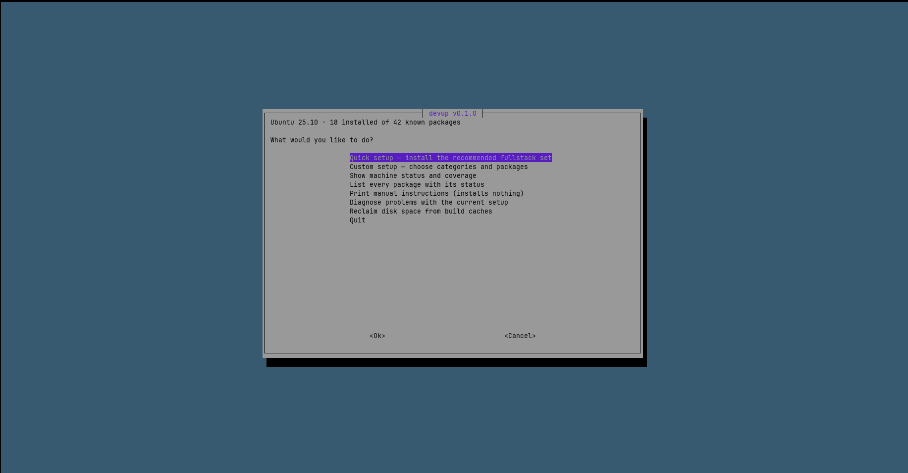

# devup

One command to turn a fresh Ubuntu install into a polyglot development machine.

Built for Go + Rust + Python + TypeScript work on a laptop with a modest CPU and
a disk that fills up faster than you expect.

```bash
curl -fsSL https://raw.githubusercontent.com/rabinhansda24/devup/main/install.sh | bash
```

Then just:

```bash
devup
```



---

## What it does

- **Detects before it installs.** Every package has a check command. Run it on a
  half-configured machine and it only does the missing work.
- **Menu-driven.** Browse by category, see what is already installed, tick what
  you want. Or use a profile and go get coffee.
- **Auto or manual.** `--manual` prints the commands instead of running them, so
  you can learn from it or cherry-pick.
- **Idempotent.** Safe to re-run. Config files use marked blocks and get backed
  up before being touched.
- **Configures, not just installs.** Docker log rotation, a shared Cargo target
  directory, the mold linker, WezTerm leader keys, sane git defaults.

## Usage

```bash
devup                              # interactive menu
devup status                       # what's on this machine
devup list                         # every package + install state
devup doctor                       # diagnose common problems

devup --profile fullstack --auto   # unattended full setup
devup --profile gnome-desktop --auto # optional GNOME desktop setup
devup --dry-run -p fullstack       # preview it, change nothing
devup --manual -p minimal          # print instructions instead

devup install ripgrep fzf lazygit  # just these
devup config shell-integration     # re-run one config step
devup clean                        # reclaim disk from build caches
```

`--dry-run` works with everything and is the recommended first run.

## Profiles

| Profile | What it's for |
|---|---|
| `fullstack` | Everything. Go, Rust, Python, Node, Docker, WezTerm, backups. |
| `minimal` | Build tools, git, and a usable shell. Nothing else. |
| `terminal-transition` | Tools for moving GUI habits into the terminal, gradually. |
| `rust-heavy` | Rust with compile-time and disk optimisations maxed out. |
| `gnome-desktop` | Optional GNOME desktop customization and quality-of-life extensions. |

Profiles are plain text files in `profiles/`. Copy one and edit it.

## What gets installed

<details>
<summary><b>System &amp; build essentials</b></summary>

`build-essential`, `pkg-config`, `libssl-dev` and the other headers that `-sys`
crates and native npm modules need, plus curl/git/unzip and zsh with
autosuggestions and syntax highlighting.
</details>

<details>
<summary><b>Shell ergonomics</b> — do these first</summary>

[starship](https://starship.rs) (prompt), [atuin](https://atuin.sh) (fuzzy
history), [zoxide](https://github.com/ajeetdsouza/zoxide) (smart cd),
[direnv](https://direnv.net) (per-project env).

A bare shell genuinely *is* worse than a GUI. These are what make it better.
</details>

<details>
<summary><b>CLI tools</b></summary>

ripgrep, fd, fzf, bat, eza, jq, dust, ncdu, delta, lazygit, gh, just, tealdeer,
yazi, chezmoi.
</details>

<details>
<summary><b>File finder</b> — Ctrl-F</summary>

`ff` puts fd, fzf and bat together into the one thing a file manager was
actually for: find a file, look at it, open it.

```
Ctrl-F              search the current directory
ff                  the same thing, typed
ff PATH             search PATH instead
ff "path with spaces"

Ctrl-Shift-F        search everything under $HOME
Alt-Shift-F         the same, in terminals that cannot send Ctrl-Shift-F
ff --global         the same thing, typed  (ff -g works too)
```

Type to filter, arrows to move, **Enter** opens the highlighted file in nano
(or vi if nano is missing), **Esc** or **Ctrl-C** leaves without opening
anything. The right-hand pane previews the file with syntax highlighting, and
moves below the list on terminals narrower than 100 columns.

Hidden files are included. `.git` is not, and neither is anything your
`.gitignore` already excludes — which is also why it stays fast in a repo with
a `node_modules` in it.

The global search is for when you know the file exists but not where — without
having to `cd` first. It skips package caches, toolchains, browser profiles and
editor extensions, which is the difference between 450k results and 8k on a
normal machine. `DEVUP_FF_GLOBAL_ROOT` changes the root; `~/.config/fd/ignore`
is fd's own file for adding your own rules. The prompt reads `global` and the
header names the root, so you always know which one you are in.
</details>

<details>
<summary><b>Language toolchains</b></summary>

[mise](https://mise.jdx.dev) manages Go, Node and Python versions with
per-project auto-switching. Rust comes from rustup, Python packaging from
[uv](https://github.com/astral-sh/uv), Node packages from pnpm.

Nothing language-related comes from apt — distro runtimes are always stale.
</details>

<details>
<summary><b>Containers</b></summary>

Docker Engine from Docker's own apt repo. **Not** Docker Desktop, which runs a
VM on Linux and costs you RAM and disk for no benefit. Plus lazydocker.
</details>

<details>
<summary><b>Terminal</b></summary>

WezTerm from the official `.deb` (never the snap) and JetBrainsMono Nerd Font,
which you need or prompt glyphs render as boxes.
</details>

<details>
<summary><b>GNOME desktop</b> — optional profile</summary>

The `gnome-desktop` profile is deliberately separate from `fullstack`. It adds
[Extension Manager](https://github.com/mjakeman/extension-manager),
[`gnome-extensions-cli`](https://github.com/essembeh/gnome-extensions-cli), and
these GNOME Shell extensions:

- [Just Perfection](https://extensions.gnome.org/extension/3843/just-perfection/)
- [User Themes](https://extensions.gnome.org/extension/19/user-themes/)
- [Wallpaper Slideshow](https://extensions.gnome.org/extension/6281/wallpaper-slideshow/)
- ChromaLeon / User Accent Colors
- [Dash to Dock](https://extensions.gnome.org/extension/307/dash-to-dock/)
- [Blur my Shell](https://extensions.gnome.org/extension/3193/blur-my-shell/)
- [Top Bar Organizer](https://extensions.gnome.org/extension/4356/top-bar-organizer/)
- Customize Clock on Lock Screen
- [GSConnect](https://extensions.gnome.org/extension/1319/gsconnect/)
- [Tiling Shell](https://extensions.gnome.org/extension/7065/tiling-shell/)
- [Search Light](https://extensions.gnome.org/extension/5489/search-light/)

Install it with:

```bash
devup --profile gnome-desktop --auto
```

Extension versions are selected for the current GNOME Shell release. Devup does
not force incompatible or rejected extension builds. If an extension has no
active compatible release, that package is reported as failed rather than
patching its metadata. Selecting upstream Dash to Dock also disables Ubuntu
Dock when the current session allows it, avoiding two competing docks.

On Wayland, a logout/login may be required before newly installed extensions
are available in the running GNOME Shell session. GSConnect should not be used
alongside the KDE Connect desktop application.
</details>

<details>
<summary><b>Backups &amp; maintenance</b></summary>

Timeshift (system snapshots), restic (encrypted `$HOME` backups), smartmontools
(SSD health — important on a second-hand drive), and `devup-clean`.
</details>

## Design decisions

A few choices that aren't obvious, and why:

**Bash, not Go or Rust.** A machine-provisioning tool written in a compiled
language needs a toolchain to build it, which is circular on a fresh install.
Bash runs on a bare Ubuntu box with nothing installed.

**A shared Cargo target directory.** `CARGO_TARGET_DIR=~/.cache/cargo-target`
deduplicates build artifacts across every project instead of a 3–5GB `target/`
per repo. On a 500GB disk with several Rust projects this is the single most
effective disk saving available.

**pnpm over npm.** The content-addressable store is the biggest disk win in the
Node ecosystem.

**Docker log rotation by default.** Unrotated container logs will silently
consume tens of gigabytes. `daemon.json` gets `max-size: 10m, max-file: 3` and a
20GB cap on the build cache.

**mold linker for Rust.** On a modest laptop CPU, linking dominates incremental
build time. mold plus `debug = "line-tables-only"` is the biggest compile-time
win short of buying a different machine.

**No aliasing of `cat` or `du`.** dust and bat take different flags. Shadowing
standard commands is how you end up unable to work on a machine that isn't
yours. Aliases here are shortcuts for things you already know how to type.

**Ctrl-F searches the current directory, not `$HOME`.** Searching from wherever
you are is faster, and it keeps a stray Ctrl-F from listing the contents of your
home directory to whoever is looking at the screen. Symlinks are not followed
for the same reason: one link is otherwise enough to turn a search of a project
into a walk through `/`. Alt-Shift-F is there when you do want the whole of
`$HOME`, and says so on screen.

**The global search answers to two keys.** A terminal sends the same `0x06` for
Ctrl-F and Ctrl-Shift-F — control characters have no shift bit — so Ctrl-Shift-F
only arrives if the terminal encodes it, which means the kitty keyboard protocol
(`CSI 102;6u`). kitty, ghostty and foot do that natively, and devup's WezTerm
config maps the key to send it; WezTerm's own Ctrl-Shift-F is replaced, but
`LEADER f` was already the same scrollback search, so nothing is lost. Somewhere
that cannot manage any of that, Alt-Shift-F does the same job: it is `ESC F`
everywhere with no configuration, and displaces only a duplicate of Alt-f, which
still works. Both keys run the same finder, so it does not matter which one your
terminal gives you.

**Generated files carry a marker.** `~/.local/bin/ff` starts with a
`devup-managed:` line, and devup compares it against the copy in `configs/`
rather than just checking that the file exists. Without that, a machine that
installed `ff` once would keep the version it first got for ever. A file without
the marker was written by someone else, so it gets backed up rather than
replaced.

**Snaps avoided.** Docker-as-snap has confinement problems with bind mounts;
editor snaps have their own. Everything here uses apt repos or vendor `.deb`s.

## Requirements

- Ubuntu 22.04, 24.04 or newer (Debian derivatives mostly work)
- x86_64 or aarch64
- `sudo` access
- git (the bootstrap installs it if missing)

The optional `gnome-desktop` profile requires a GNOME Shell desktop session.

## Help make devup cross-platform

devup works on Ubuntu today. The goal is bigger: **one dependable command to
bootstrap a development machine on any major developer OS**.

Contributions for additional platforms are welcome, especially:

- Fedora / RHEL-family Linux
- Arch Linux
- macOS
- Windows / WSL-aware setup

Cross-platform support should not become a pile of `if OS == ...` branches.
The preferred direction is to keep package definitions and profiles reusable,
while moving OS-specific installation, detection and configuration behind
platform adapters.

If you use another OS and want devup there, open an issue or PR. Even a tested
design proposal, package mapping, or proof-of-concept adapter is useful.

See [CONTRIBUTING.md](CONTRIBUTING.md) for the contribution rules.

## Safety

- Nothing runs without showing you the plan first, unless you pass `--yes`.
- Existing config files are backed up to `<file>.devup-bak.<timestamp>`.
- Additions to `.zshrc`/`.bashrc` go inside `# >>> devup:... >>>` markers, so
  they can be updated or removed without touching the rest of the file.
- Vendor install scripts (rustup, mise, uv, starship, atuin) are piped to `sh`,
  which is the officially supported path for those tools. The URL is always
  printed before it runs. If you'd rather not, use `--manual` and audit each one.
- Full log at `~/.local/state/devup/devup.log`.

## Uninstalling

devup doesn't track what it installed for removal — it's a setup tool, not a
package manager. To undo its *configuration*:

```bash
rm -rf ~/.config/devup
# then delete the "# >>> devup:... >>>" blocks from ~/.zshrc and ~/.bashrc
rm ~/.local/bin/devup ~/.local/bin/devup-clean ~/.local/bin/ff
rm -rf ~/.local/share/devup
```

Backups of anything it replaced are alongside the originals as `*.devup-bak.*`.

## Contributing

Adding a tool is usually a 10-line block in a file under `modules/`. See
[CONTRIBUTING.md](CONTRIBUTING.md).

## License

MIT
